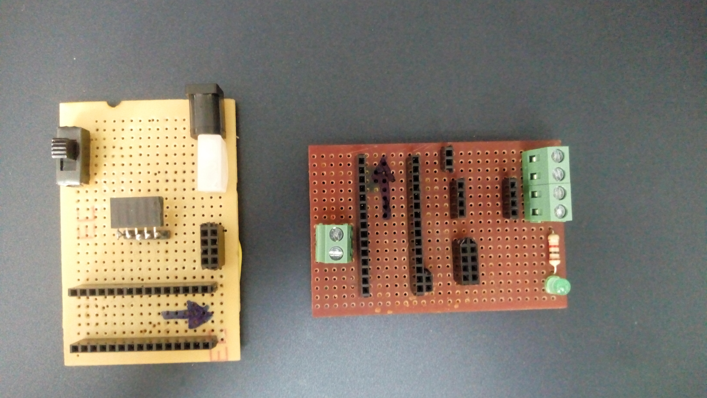
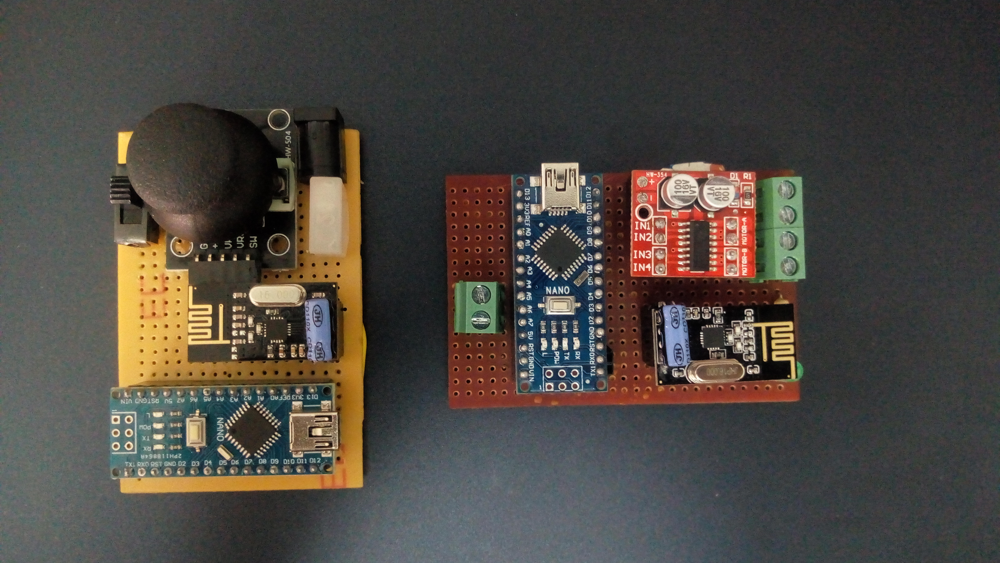
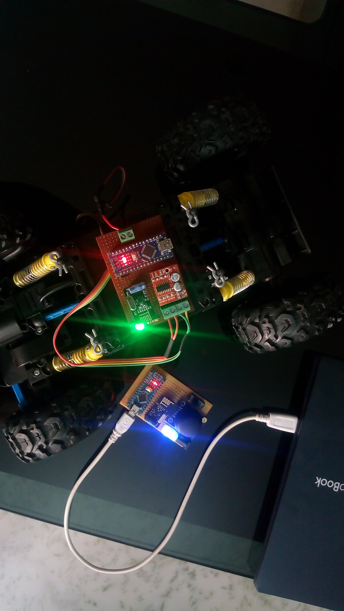
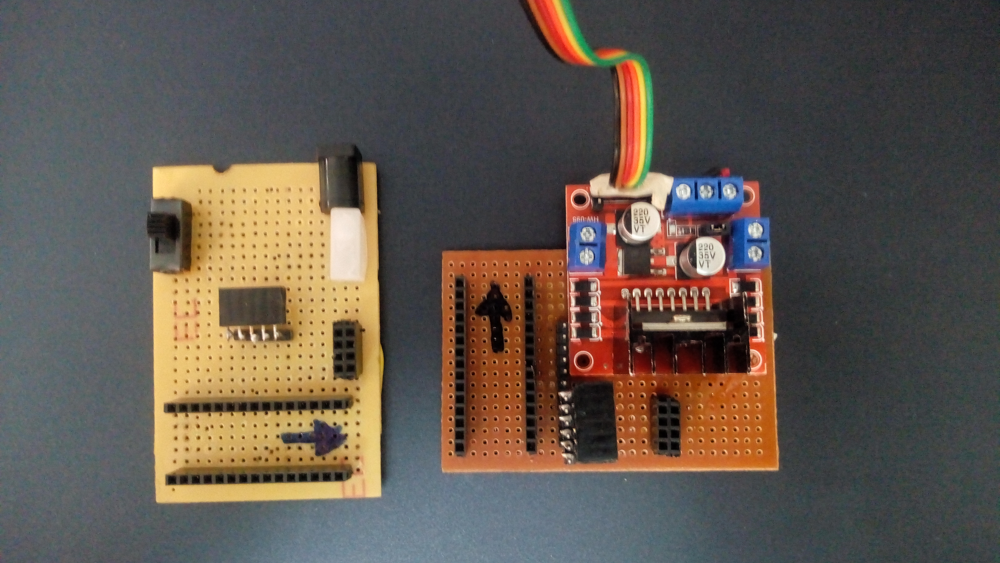
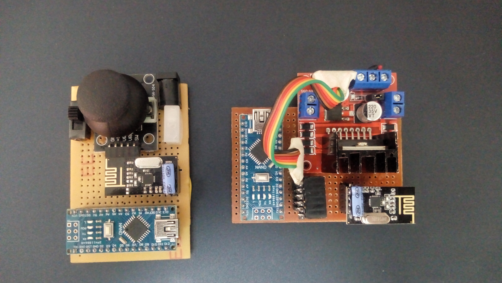
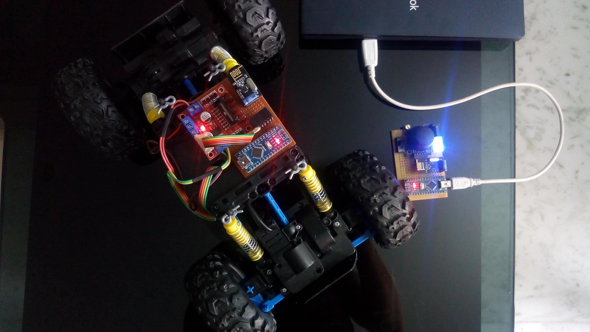

# NRF24-RC-Crawler

### Description: Remote allows player to control motion of toy car. My modules are of 2 types, one with the speed control and another on without using nrf24l01 module..
### for RC cars, traxxas typos, Crawles, jeeps, and all steering typo RC cars.

**Components:**

    arduino nano 2 for TX and RX
    nRF24L01 2 for TX and RX
    some wires
    joystick to control
    L298N (DualH-bridge //2A) for speedcontrol
    mx1508 (DualH-bridge//1.5A) without speedcontrol
    pcb boards 
    some batteries
    leds for indicator if required.
    2 10mf capacitors for NRFmodules each
    resisotors for leds if.
    
 
 ### TX and RX pcb board for without speed control module
 
 
 
```
 connections to tx nano (joystick)
 
 battery + > vin  
 battery - > gnd
 
 nrf24l01
 GND    >  GND
 VIN    > arduino nano 3.3v or even u can add one li-on 3v coin cell for stable connectons.
 CE     >   9
 CNS    >  10
 SCK    >  13
 MOSI   > 11
 MISO   > 12
 
 joystick HW-504
 VIN    > +5v nano
 GND    > GND    
 VRx    > A3
 VRy    > A4 pin of arduino nano
 


connections to rx nano (crawler)
 
 battery + > vin  
 battery - > gnd
 
 NRF24
 GND    >  GND
 VIN    > arduino nano 3.3v or even u can add one li-on 3v coin cell for stable connectons.
 CE     >   9
 CNS    >  10
 SCK    >  13
 MOSI   > 11
 MISO   > 12
 
 mx1508
 IN1    >  3
 IN2    >  4
 IN3    >  5
 IN4    >  6th pis of arduino nano 
 
```
 **as shown below**
 
   
 
**demo**
 
   
 
 
 
 
 
 ### TX and RX pcb board for with speed control module
 
   

```
  connections to tx nano (joystick)
 
 battery + > vin  
 battery - > gnd
 
 NRF24
 GND    >  GND
 VIN    > arduino nano 3.3v or even u can add one li-on 3v coin cell for stable connectons.
 CE     >   9
 CNS    >  10
 SCK    >  13
 MOSI   > 11
 MISO   > 12
 
 joystick HW-504
 VIN    > +5v nano
 GND    > GND    
 VRx    > A3
 VRy    > A4 pin of arduino nano
 


connections to rx nano (crawler)
 
 battery + > vin  
 battery - > gnd
 
 nrf24l01
 GND    >  GND
 VIN    > arduino nano 3.3v or even u can add one li-on 3v coin cell for stable connectons.
 CE     >   9
 CNS    >  10
 SCK    >  13
 MOSI   > 11
 MISO   > 12
 
 L298N or L293D
 ENA    >  5
 IN1    >  3
 IN2    >  4
 IN3    >  7
 IN4    >  8
 ENB    >  6th pis of arduino nano
```
 
 
 ** shown bwlow **
 
   
 
 ** demo **
 
   
  
    
